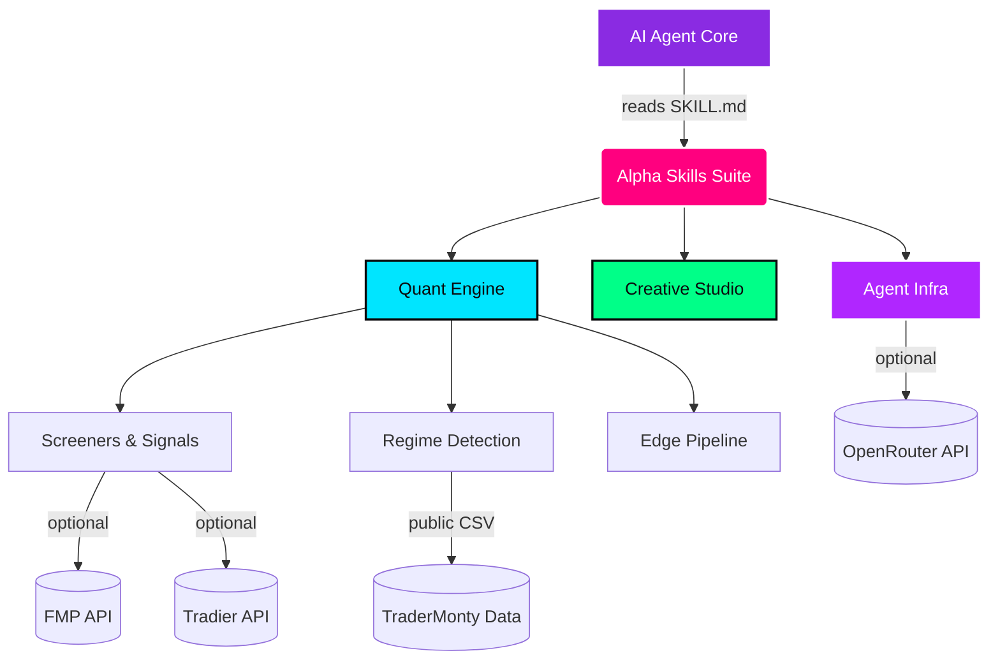

<div align="center">
  

  # 🌌 The Alpha Skills Suite

  **113 Elite AI Agent Skills for Quant Trading, Market Intelligence, and Creative Production**

  [](https://github.com/mphinance/antigravity-skills/stargazers)
  [](#)
  [](#)
  [](#)
</div>

---

## 📑 Table of Contents

- [🧠 The "Aha!" Moment](#-the-aha-moment)
- [🏗️ System Architecture](#️-system-architecture)
- [🚀 Quick Start](#-quick-start)
- [🔥 The Quant Trading Engine](#-the-quant-trading-engine)
  - [Strategy Optimization & Backtesting](#strategy-optimization--backtesting)
  - [Market Intelligence & Regime Detection](#market-intelligence--regime-detection)
  - [The Edge Research Pipeline](#the-edge-research-pipeline)
  - [Stock Screening](#stock-screening)
  - [Options, Portfolio & Risk Management](#options-portfolio--risk-management)
  - [Dividend & Income (Kanchi Method)](#dividend--income-kanchi-method)
  - [Market Analysis & News](#market-analysis--news)
- [🎨 Creative Production & Prototyping](#-creative-production--prototyping)
  - [Web, Dashboards & Presentations](#web-dashboards--presentations)
  - [Content, Documents & Voice](#content-documents--voice)
  - [Media Generation](#media-generation)
- [⚙️ Agent Infrastructure & Workflow](#️-agent-infrastructure--workflow)
  - [Thinking & Decision Making](#thinking--decision-making)
  - [Skill Lifecycle](#skill-lifecycle)
  - [Development Workflow](#development-workflow)
- [💼 Enterprise & Contact](#-enterprise--contact)

---

## 🧠 The "Aha!" Moment

AI agents like Claude Code and Gemini are only as good as the context you provide them. Out of the box, they are brilliant generalists.

**This repository gives them a PhD in algorithmic trading and a master's in design.**

By dropping these `skills/` into your agent's workspace, you inject decades of domain expertise, algorithmic rigor, and aesthetic taste directly into their runtime. You aren't just getting scripts. You are getting autonomous agents capable of identifying market regimes, rewriting PineScript to Python, running full design critiques, and generating Substack-ready financial reports.

> **On Modularity:** A "Full Tower" audit was performed across all 113 directories. Every single skill is structurally unique. Even seemingly overlapping skills (like Breadth vs. Uptrend analyzers) are intentionally decoupled, serving as independent, uncorrelated inputs for the downstream Druckenmiller Strategy Synthesizer.

---

## 🏗️ System Architecture



---

## 🚀 Quick Start

1. Clone this repository.
2. Copy the `skills/` folder into your agent's skill directory:
   - **Gemini CLI / Antigravity:** `~/.gemini/antigravity/skills/`
   - **Claude Code:** Your project root or global config.
3. Start your agent. It auto-detects and indexes every skill.

### 🔑 API Keys (optional)

Most skills work out of the box with zero configuration. A subset of quant screeners require paid data APIs:

| Key | Service | Used By |
|-----|---------|---------|
| `FMP_API_KEY` | [Financial Modeling Prep](https://financialmodelingprep.com/) | 18 screeners/detectors (see tables below) |
| `TRADIER_API_KEY` | [Tradier Brokerage](https://tradier.com/) | `ghost-auto-trader` |
| `OPENROUTER_API_KEY` | [OpenRouter](https://openrouter.ai/) | `urithiru` multi-model verification |

---

## 🔥 The Quant Trading Engine

*Built for traders, by traders. Automates the tedious parts of algorithmic research and protects you from your own biases.*

### Strategy Optimization & Backtesting

| Skill | What It Does | API Key |
|-------|--------------|---------|
| [pine-to-python](skills/pine-to-python/) | Translates TradingView PineScript into vectorized Python with auto-extracted params for Optuna optimization. | - |
| [quant-feature-engineer](skills/quant-feature-engineer/) | Renaissance Tech-style feature engineering. Build unified scoring models instead of isolated strategies. | - |
| [ghost-auto-trader](skills/ghost-auto-trader/) | TV webhook -> AI Gate -> Broker Execution pipeline for 0DTE options. | `TRADIER_API_KEY` |
| [backtest-expert](skills/backtest-expert/) | The "beat ideas to death" methodology. Slippage modeling, bias prevention, overfitting detection. | - |
| [edge-strategy-reviewer](skills/edge-strategy-reviewer/) | LLM "Pessimistic Strategist". Issues PASS/REVISE/REJECT verdicts on strategy drafts. | - |
| [strategy-pivot-designer](skills/strategy-pivot-designer/) | Detects Optuna local optima and proposes structurally different strategy pivots. | - |
| [signal-postmortem](skills/signal-postmortem/) | Post-trade autopsy. Tracks false positives, regime mismatches, and missed opportunities. | `FMP_API_KEY` |
| [trade-hypothesis-ideator](skills/trade-hypothesis-ideator/) | Generates falsifiable trade hypotheses from market data, trade logs, and journal snippets. | - |
| [diagnose](skills/diagnose/) | Disciplined diagnosis loop for hard bugs and performance regressions in trading bots. | - |

### Market Intelligence & Regime Detection

*Methodologies adapted from TraderMonty, William O'Neil, and Mark Minervini.*

| Skill | What It Does | API Key |
|-------|--------------|---------|
| [stanley-druckenmiller-investment](skills/stanley-druckenmiller-investment/) | **The Crown Jewel.** Synthesizes 8 upstream signals into a single 0-100 conviction score and allocation map. | - |
| [us-market-bubble-detector](skills/us-market-bubble-detector/) | Minsky/Kindleberger framework. Mechanically scores Put/Call, VIX, margin debt, and IPO data. | - |
| [market-breadth-analyzer](skills/market-breadth-analyzer/) | 0-100 composite breadth score from public CSV data. No API key required. | - |
| [uptrend-analyzer](skills/uptrend-analyzer/) | Market breadth via Monty's Uptrend Ratio Dashboard. 0-100 composite from 5 components. | - |
| [breadth-chart-analyst](skills/breadth-chart-analyst/) | Analyzes S&P 500 Breadth Index charts (200-Day MA based) for strategic positioning. | - |
| [sector-analyst](skills/sector-analyst/) | Sector rotation patterns, cyclical vs. defensive assessment, market cycle phase estimation. | - |
| [macro-regime-detector](skills/macro-regime-detector/) | Structural 1-2 year regime shifts (Concentration / Broadening / Inflationary). | `FMP_API_KEY` |
| [market-top-detector](skills/market-top-detector/) | Tactical 2-8 week defensive timing using Distribution Days and sector rotation. | `FMP_API_KEY` |
| [ftd-detector](skills/ftd-detector/) | Follow-Through Day detector for market bottom confirmation. | `FMP_API_KEY` |
| [ibd-distribution-day-monitor](skills/ibd-distribution-day-monitor/) | IBD-style distribution day counting, clustering, and invalidation tracking. | `FMP_API_KEY` |
| [exposure-coach](skills/exposure-coach/) | Net exposure ceiling, growth-vs-value bias, and new-entry-allowed recommendations. | `FMP_API_KEY` |
| [downtrend-duration-analyzer](skills/downtrend-duration-analyzer/) | Historical downtrend duration analysis with interactive HTML histograms by sector/cap. | `FMP_API_KEY` |
| [theme-detector](skills/theme-detector/) | Detects trending market themes across sectors with lifecycle analysis. | `FMP_API_KEY` |
| [scenario-analyzer](skills/scenario-analyzer/) | 18-month scenario analysis from news headlines. Multi-agent (analyst + reviewer). | - |
| [technical-analyst](skills/technical-analyst/) | Weekly chart analysis: trend, support/resistance, scenario planning, probability. | - |

### The Edge Research Pipeline

An automated, end-to-end factory for finding alpha. Six skills chained into a single pipeline:

```
edge-hint-extractor -> edge-concept-synthesizer -> edge-strategy-designer
       -> edge-strategy-reviewer -> edge-candidate-agent -> edge-pipeline-orchestrator
```

| Skill | Role in Pipeline | API Key |
|-------|-----------------|---------|
| [edge-hint-extractor](skills/edge-hint-extractor/) | Extracts edge hints from daily observations and news. Outputs `hints.yaml`. | - |
| [edge-concept-synthesizer](skills/edge-concept-synthesizer/) | Abstracts hints into reusable edge concepts with thesis and invalidation signals. | - |
| [edge-strategy-designer](skills/edge-strategy-designer/) | Converts concepts into strategy draft variants and exportable ticket YAMLs. | - |
| [edge-strategy-reviewer](skills/edge-strategy-reviewer/) | Quality gate. PASS/REVISE/REJECT verdicts with confidence scores. | - |
| [edge-candidate-agent](skills/edge-candidate-agent/) | Generates prioritized research tickets and pipeline-ready candidate specs. | - |
| [edge-pipeline-orchestrator](skills/edge-pipeline-orchestrator/) | Orchestrates the full pipeline end-to-end. | - |
| [edge-signal-aggregator](skills/edge-signal-aggregator/) | Aggregates signals from multiple skills into a ranked conviction dashboard. | - |

### Stock Screening

| Skill | What It Does | API Key |
|-------|--------------|---------|
| [vcp-screener](skills/vcp-screener/) | Minervini VCP scanner. Tight bases, volatility contraction, Stage 2 uptrends. | `FMP_API_KEY` |
| [canslim-screener](skills/canslim-screener/) | William O'Neil's CANSLIM methodology scanner. | `FMP_API_KEY` |
| [pead-screener](skills/pead-screener/) | Post-Earnings Announcement Drift detector. Red-candle pullbacks post-gap-up. | `FMP_API_KEY` |
| [pair-trade-screener](skills/pair-trade-screener/) | Statistical arbitrage. Cointegrated pairs, z-scores, mean-reversion entries. | `FMP_API_KEY` |
| [dividend-growth-pullback-screener](skills/dividend-growth-pullback-screener/) | 12%+ dividend growers experiencing RSI oversold pullbacks. | `FMP_API_KEY` |
| [value-dividend-screener](skills/value-dividend-screener/) | Value + dividend: P/E under 20, yield 3%+, 3-year consistent growth. | `FMP_API_KEY` |
| [earnings-trade-analyzer](skills/earnings-trade-analyzer/) | 5-factor scoring (Gap/Trend/Volume/MA200/MA50) for post-earnings stocks. | `FMP_API_KEY` |
| [earnings-calendar](skills/earnings-calendar/) | Upcoming earnings announcements organized by market impact and date. | `FMP_API_KEY` |
| [finviz-screener](skills/finviz-screener/) | Build and open FinViz screener URLs from natural language. English and Japanese. | - |
| [breakout-trade-planner](skills/breakout-trade-planner/) | Minervini-style trade plans from VCP screener output with position sizing. | - |
| [us-stock-analysis](skills/us-stock-analysis/) | Comprehensive fundamental + technical analysis and investment reports. | - |
| [institutional-flow-tracker](skills/institutional-flow-tracker/) | 13F filing analysis. Smart money accumulation/distribution tracking. | `FMP_API_KEY` |

### Options, Portfolio & Risk Management

| Skill | What It Does | API Key |
|-------|--------------|---------|
| [position-sizer](skills/position-sizer/) | Risk-based sizing: Kelly Criterion, ATR scaling, sector heat checks. | - |
| [options-strategy-advisor](skills/options-strategy-advisor/) | Black-Scholes pricing, Greeks, P/L simulation for complex structures. | `FMP_API_KEY` |
| [portfolio-manager](skills/portfolio-manager/) | Connects to Alpaca MCP for allocation analysis, risk metrics, and rebalancing. | Alpaca MCP |
| [trader-memory-core](skills/trader-memory-core/) | State machine tracking theses from idea to closed-trade MAE/MFE postmortem. | - |

### Dividend & Income (Kanchi Method)

*Workflows adapted from the Kanchi Japanese investing methodology.*

| Skill | What It Does | API Key |
|-------|--------------|---------|
| [kanchi-dividend-sop](skills/kanchi-dividend-sop/) | Full SOP: screening, entry planning, and monitoring cadence. | `FMP_API_KEY` |
| [kanchi-dividend-review-monitor](skills/kanchi-dividend-review-monitor/) | Automated T1-T5 triggers for 8-K governance and dividend safety checks. | - |
| [kanchi-dividend-us-tax-accounting](skills/kanchi-dividend-us-tax-accounting/) | US tax optimization: Qualified vs. Ordinary, REIT/BDC treatment. | - |

### Market Analysis & News

| Skill | What It Does | API Key |
|-------|--------------|---------|
| [market-environment-analysis](skills/market-environment-analysis/) | Comprehensive global market analysis: US, Europe, Asia, forex, commodities. | - |
| [market-news-analyst](skills/market-news-analyst/) | Analyzes recent market-moving news and their impact on equities/commodities. | - |
| [economic-calendar-fetcher](skills/economic-calendar-fetcher/) | Upcoming economic events: central bank decisions, employment, inflation, GDP. | `FMP_API_KEY` |
| [data-quality-checker](skills/data-quality-checker/) | Validates price scale, instrument notation, and date accuracy in reports. | - |

---

## 🎨 Creative Production & Prototyping

*Build the algorithms, then build the SaaS companies to sell them.*

### Web, Dashboards & Presentations

| Skill | What It Does | API Key |
|-------|--------------|---------|
| [mph-synthwave-theme](skills/mph-synthwave-theme/) | **Brand source-of-truth.** Neon Cyan/Pink/Green, glassmorphism, JetBrains Mono. | - |
| [dashboard](skills/dashboard/) | Single-file HTML admin/analytics dashboard with KPI cards and charts. | - |
| [saas-landing](skills/saas-landing/) | Complete marketing page: hero, features, social proof, pricing, CTAs. | - |
| [web-prototype](skills/web-prototype/) | General-purpose desktop web prototype from section layouts. | - |
| [replit-deck](skills/replit-deck/) | Horizontal-swipe pitch decks in Replit Slides style. 8 themes. | - |
| [simple-deck](skills/simple-deck/) | Lightweight horizontal-swipe HTML decks for presentations. | - |
| [guizang-ppt](skills/guizang-ppt/) | E-magazine style presentations with WebGL fluid backgrounds. | - |
| [weekly-update](skills/weekly-update/) | Weekly team update slide deck: shipped, in flight, blocked, metrics. | - |
| [mobile-app](skills/mobile-app/) | Pixel-accurate iPhone 15 Pro framed mobile prototypes. | - |
| [mobile-onboarding](skills/mobile-onboarding/) | Multi-screen onboarding flow: splash, value-prop, sign-in. | - |
| [pricing-page](skills/pricing-page/) | Standalone pricing page with plan tiers, feature comparison, FAQ. | - |
| [gamified-app](skills/gamified-app/) | Multi-frame gamified mobile app: quests, XP ribbons, level bars. | - |
| [dating-web](skills/dating-web/) | Consumer-feel matchmaking dashboard with KPIs and trend blocks. | - |
| [kanban-board](skills/kanban-board/) | Kanban task board with columns, cards, avatars, and swimlanes. | - |
| [wireframe-sketch](skills/wireframe-sketch/) | Hand-drawn wireframe on graph paper with marker/pencil annotations. | - |
| [tweaks](skills/tweaks/) | Wraps any HTML with live controls panel for real-time CSS tuning. | - |

### Content, Documents & Voice

| Skill | What It Does | API Key |
|-------|--------------|---------|
| [mph-substack-writer](skills/mph-substack-writer/) | Michael's exact Substack voice. No em dashes. No markdown tables. PG-13. | - |
| [blog-post](skills/blog-post/) | Long-form article with masthead, hero image, body, byline, related posts. | - |
| [edit-article](skills/edit-article/) | Restructures sections, improves clarity, tightens prose. | - |
| [docs-page](skills/docs-page/) | Documentation page with left nav, article body, right-rail TOC. | - |
| [pm-spec](skills/pm-spec/) | Product spec / PRD: problem, metrics, scope, user stories, rollout plan. | - |
| [finance-report](skills/finance-report/) | Quarterly/monthly financial report: KPIs, P&L, charts, outlook. | - |
| [meeting-notes](skills/meeting-notes/) | Meeting notes: attendees, agenda, decisions, action items, next meeting. | - |
| [eng-runbook](skills/eng-runbook/) | Engineering runbook: alerts, dashboards, procedures, on-call rotation. | - |
| [hr-onboarding](skills/hr-onboarding/) | New-hire onboarding plan: first week, buddy, equipment, outcomes. | - |
| [team-okrs](skills/team-okrs/) | OKR tracker with objectives, key results, progress bars, status pills. | - |
| [invoice](skills/invoice/) | Printable invoice: line items, tax breakdown, totals, payment terms. | - |
| [digital-eguide](skills/digital-eguide/) | Two-spread digital e-guide: cover + lesson spread with pull-quotes. | - |
| [email-marketing](skills/email-marketing/) | Brand product-launch email with hero block, headline lockup, specs grid. | - |

### Media Generation

| Skill | What It Does | API Key |
|-------|--------------|---------|
| [hyperframes](skills/hyperframes/) | Programmable video compositions, audio-reactive visuals, kinetic typography. | - |
| [image-poster](skills/image-poster/) | Editorial-style poster and key art generation via Flux/Midjourney. | - |
| [audio-jingle](skills/audio-jingle/) | Voiceovers, jingles, and SFX via ElevenLabs/Suno/MiniMax. | - |
| [video-shortform](skills/video-shortform/) | 3-10 second clips: product reveals, motion teasers, ambient loops. | - |
| [social-carousel](skills/social-carousel/) | Cinematic 3-card 1080x1080 social media carousels. | - |
| [magazine-poster](skills/magazine-poster/) | Editorial newsprint poster with oversized serif headlines. | - |
| [motion-frames](skills/motion-frames/) | Single-frame motion-design with looping CSS animations. | - |
| [sprite-animation](skills/sprite-animation/) | Pixel/sprite-style animated explainer with kinetic typography. | - |
| [critique](skills/critique/) | 5-dimension expert design review with radar chart and scoring. | - |
| [design-brief](skills/design-brief/) | Parses I-Lang protocol briefs into concrete design specs. | - |

---

## ⚙️ Agent Infrastructure & Workflow

### Thinking & Decision Making

| Skill | What It Does | API Key |
|-------|--------------|---------|
| [urithiru](skills/urithiru/) | **Multi-lane AI verification.** Fans out queries to 5-7 models, synthesizes consensus. | `OPENROUTER_API_KEY` |
| [mental-model-evaluator](skills/mental-model-evaluator/) | Runs plans through Inversion, First Principles, Second-Order thinking. | - |
| [grill-me](skills/grill-me/) | Relentless interview until the decision tree is fully mapped. | - |
| [grill-with-docs](skills/grill-with-docs/) | Grill session that challenges plans against the domain model and updates docs. | - |
| [caveman](skills/caveman/) | Ultra-compressed communication mode. Cuts token usage by ~75%. | - |
| [future-predictor](skills/future-predictor/) | Generates structured predictions and scenario forecasts. | - |

### Skill Lifecycle

| Skill | What It Does | API Key |
|-------|--------------|---------|
| [portable-memory-core](skills/portable-memory-core/) | One Brain protocol. Portable `.agent/` folder for preferences and context. | - |
| [skill-warden](skills/skill-warden/) | Health and security audits: dead skills, conflicting triggers, risky shell calls. | - |
| [skill-designer](skills/skill-designer/) | Writes new skills from structured idea specs following repo conventions. | - |
| [write-a-skill](skills/write-a-skill/) | Create skills with proper structure, progressive disclosure, bundled resources. | - |
| [dual-axis-skill-reviewer](skills/dual-axis-skill-reviewer/) | Deterministic + LLM deep review. 0-100 quality score for PR gating. | - |
| [skill-idea-miner](skills/skill-idea-miner/) | Mines session logs for skill idea candidates. | - |
| [skill-integration-tester](skills/skill-integration-tester/) | Validates multi-skill workflows, data contracts, and handoff integrity. | - |

### Development Workflow

| Skill | What It Does | API Key |
|-------|--------------|---------|
| [tdd](skills/tdd/) | Test-driven development with red-green-refactor loop. | - |
| [qa](skills/qa/) | Interactive QA: conversational bug reports filed as GitHub issues. | - |
| [triage](skills/triage/) | Issue triage through a state machine driven by triage roles. | - |
| [to-issues](skills/to-issues/) | Breaks plans/specs into independently-grabbable issues as vertical slices. | - |
| [to-prd](skills/to-prd/) | Converts conversation context into a published PRD. | - |
| [request-refactor-plan](skills/request-refactor-plan/) | Detailed refactor plan with tiny commits, filed as a GitHub issue. | - |
| [improve-codebase-architecture](skills/improve-codebase-architecture/) | Finds deepening opportunities informed by domain language and ADRs. | - |
| [design-an-interface](skills/design-an-interface/) | Generates multiple radically different interface designs via parallel agents. | - |

---

## 💼 Enterprise & Contact

The days of manual trading and generic ChatGPT prompts are over. If you are a hedge fund, prop desk, or SaaS founder looking to implement autonomous workflows, custom LLM strategy evaluators, or high-frequency data pipelines:

- **Newsletter & Deep Dives:** [mphinance.substack.com](https://mphinance.substack.com/)
- **Trading Tools:** [TraderDaddy Pro](https://www.traderdaddy.pro/?ref=8DUEMWAJ)
- **Support the Project:** [Buy me a coffee on Ko-fi](https://ko-fi.com/mphinance)

*Built by [@mphinance](https://github.com/mphinance).*
